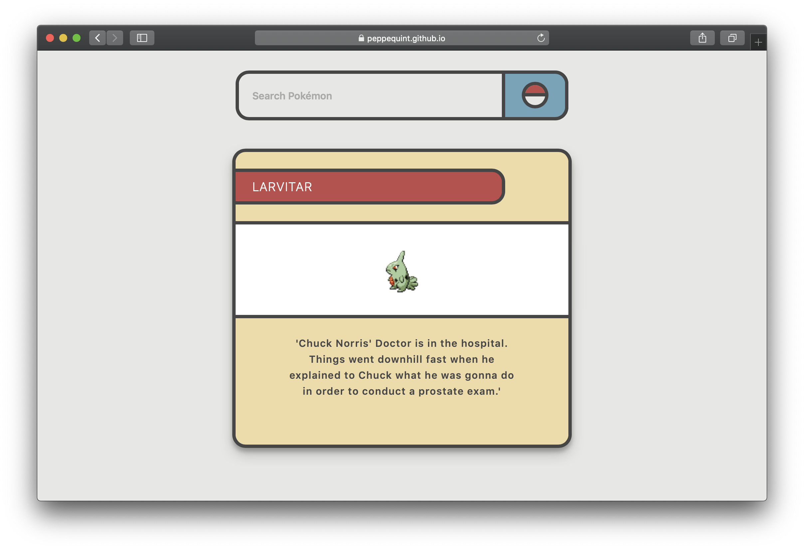

	<h1 align='center'>Random Pokédex</h1>
	

	A <a href='https://peppequint.github.io/web-app-from-scratch-18-19/week1/index.html'>Pokédex</a> with random Chuck Norris  quotes.

 

## Table Of Contents

- [What to do?](#what-to-do?)
- [API's](#api's)
- [How does it work?](#how-does-it-work)
- [Sources](#sources)

## What To Do?

- [x] Get data from API async
- [ ] Rendering data to overview page
- [ ] Improving search function
- [ ] Add asides to show extra values of data

## API's

### Pokemon API

[Link to API](https://pokeapi.co/)

### Chuck Norris API

[Link to API](https://api.chucknorris.io/)

### Countires API

[Link to API](https://restcountries.eu/)

## How does it work?

## Sources
