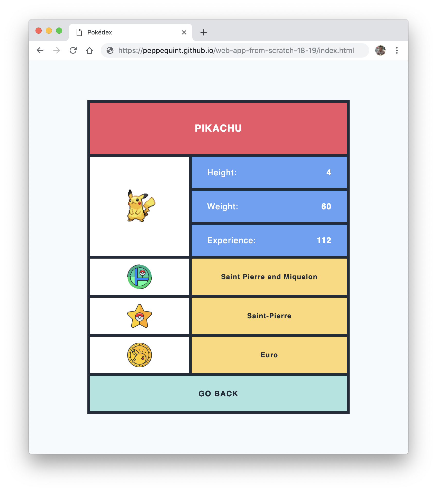
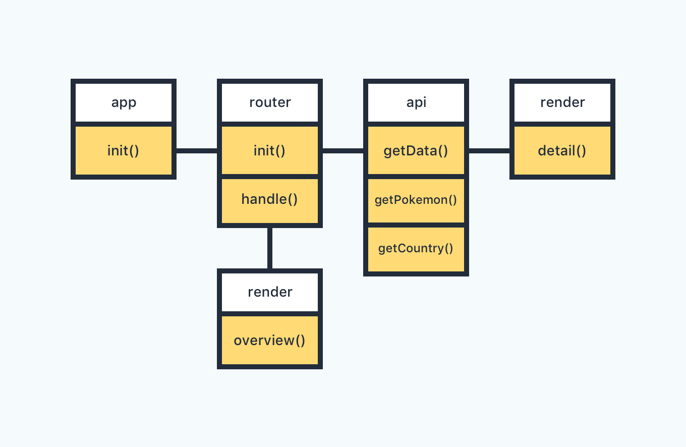
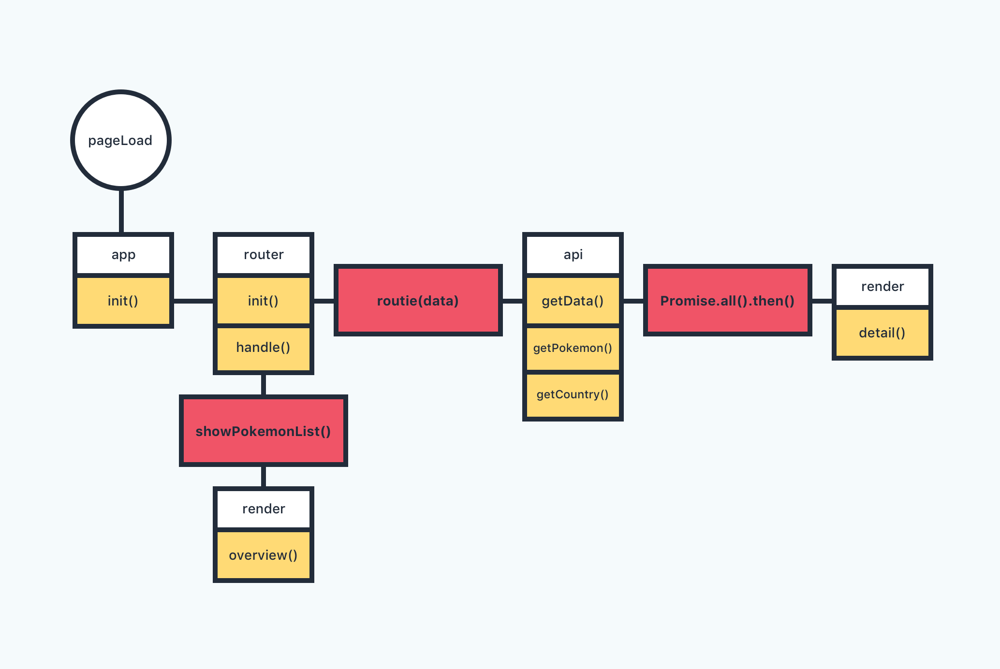

<p align="center">
	<h1 align='center'>Where is this Pokémon born?</h1>
	
</p>
<p align="center">
	A Pokédex to find where a Pokemon is born and what his statistics are.
</p>
<br>

## Table Of Contents

- [Get project](#get-project)
- [API's](#api's)
- [Diagrams](#diagrams)
- [Work to do](#work-to-do)
- [Sources](#sources)

## Get project

To use this project, it is necessary that you need a local server to run the project on.

```shell
# Clone repository
git clone https://github.com/peppequint/web-app-from-scratch-18-19.git

# Go to the repository
cd web-app-from-scratch-18-19
```

## API's

### Pokemon API

First of all, I used the Pokemon API to get specific data about every Pokemon of this great Nintendo game. What kind of data do I use from this API?

```JSON
{
	"base_experience": 122,
	"height": 4,
	"name": "pikachu",
	"weight": 60
}
```

As I mentioned below, the data must be cleaned up better before it is used. That is one of the points of improvement.

[Link to API](https://pokeapi.co/)

### Countries API

The second API this application uses, is the API of all the countries of the world. The requests to the API are totally random, based on `Math.floor(Math.random() * 249 + 1)`. The following data does this application use.

```JSON
{
	"name": "Ethiopia",
	"capital": "Addis Ababa",
	"currencies": {
		"name": "Ethiopian birr"
	}
}
```

[Link to API](https://restcountries.eu/)

## Diagrams

### Actor diagram



### Interaction diagram



## Work to do

- [ ] Create modules
- [ ] Better naming for parts of code
- [ ] Improving search function
- [ ] Clean the code better before it is being used

## Sources

- [Pokemon Icons](https://roundicons.com/icon-packs/pokemon-go-filled-outline-icons/)
- [Pokemon API](https://pokeapi.co/)
- [Countries API](https://restcountries.eu/)
