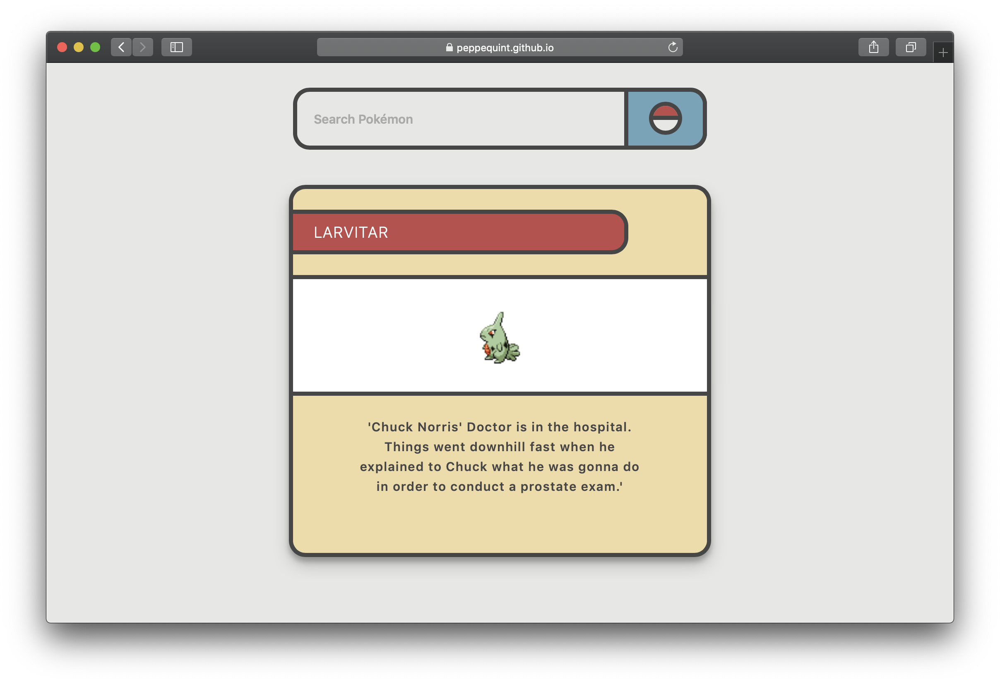

# Web App From Scratch

Doel: Data ophalen uit een API en renderen in een overzichtspagina.

[Opdrachten](https://drive.google.com/open?id=1OVhWQNaCgSluYviTKKWcApkyPd23xow1PiExb8GYANM)

[Slides](https://drive.google.com/open?id=1Rjl9xqXoKniQSRJPdkU1O5YwWC33SJK8KiV0a-H_xZU)

## Table Of Contents

- [What to do?](#what-to-do?)
- [Description](#description)
- [API's](#api's)
- [How does it work?](#how-does-it-work)
- [Sources](#sources)

## What To Do?

## Description

## API's

## How does it work?

## Sources
